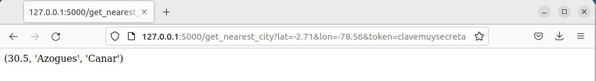

.. nearest_city_distance documentation master file, created by
   sphinx-quickstart on Thu Oct 13 12:56:47 2022.
   You can adapt this file completely to your liking, but it should at least
   contain the root `toctree` directive.

Nearest City Distance's documentation!
=================================================

 
Program to detect the distance to the nearest city based on the coordinates indicated when running the program.

.. toctree::
   :maxdepth: 2
   :caption: Contents:

Result:
------------------------------------

If the program execution is successful, it should be displayed:

1.  Distance
2.  City
3.  Province or State

Indices and tables
==================

* :ref:`genindex`
* :ref:`modindex`
* :ref:`search`
